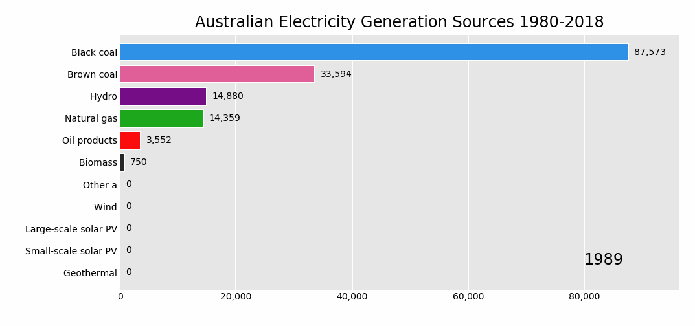
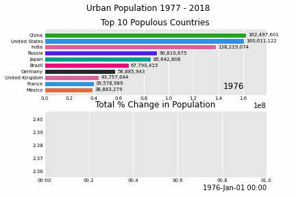

# Pandas_Alive

Animated plotting extension for Pandas with Matplotlib

**Pandas_Alive** is intended to provide a plotting backend for animated [matplotlib](https://matplotlib.org/) charts for [Pandas](https://pandas.pydata.org/) DataFrames, similar to the already [existing Visualization feature of Pandas](https://pandas.pydata.org/pandas-docs/stable/visualization.html).

With **Pandas_Alive**, creating stunning, animated visualisations is as easy as calling:

`df.plot_animated()`


## Installation

Install with `pip install pandas_alive`

## Usage

As this package builds upon [`bar_chart_race`](https://github.com/dexplo/bar_chart_race), the example data set is sourced from there.

Must begin with a pandas DataFrame containing 'wide' data where:

- Every row represents a single period of time
- Each column holds the value for a particular category
- The index contains the time component (optional)

The data below is an example of properly formatted data. It shows total deaths from COVID-19 for the highest 20 countries by date.


[Example Table](examples/example_dataset_table.md)

To produce the above visualisation:

- Check [Requirements](#requirements) first to ensure you have the tooling installed!
- Call `plot_animated()` on the DataFrame
    - Either specify a file name to write to with `df.plot_animated(filename='example.mp4')` or use `df.plot_animated().get_html5_video` to return a HTML5 video
- Done!

``` python
import pandas_alive

covid_df = pandas_alive.load_dataset()

covid_df.plot_animated(filename='examples/example-barh-chart.gif')
```

### Currently Supported Chart Types

`pandas_alive` current supports:

- [Horizontal Bar Charts](#horizontal-bar-charts)
- [Vertical Bar Charts](#vertical-bar-charts)
- [Line Charts](#line-charts)
- [Scatter Charts](#scatter-charts)

#### Horizontal Bar Charts

``` python
import pandas_alive

covid_df = pandas_alive.load_dataset()

covid_df.plot_animated(filename='example-barh-chart.gif')
```


``` python
import pandas as pd
import pandas_alive

elec_df = pd.read_csv("data/Aus_Elec_Gen_1980_2018.csv",index_col=0,parse_dates=[0],thousands=',')

elec_df.fillna(0).plot_animated('examples/example-electricity-generated-australia.gif',period_fmt="%Y",title='Australian Electricity Generation Sources 1980-2018')
```



#### Vertical Bar Charts

``` python
import pandas_alive

covid_df = pandas_alive.load_dataset()

covid_df.plot_animated(filename='examples/example-barv-chart.gif',orientation='v')
```


#### Line Charts

With as many lines as data columns in the DataFrame.

``` python
import pandas_alive

covid_df = pandas_alive.load_dataset()

covid_df.diff().fillna(0).plot_animated(filename='examples/example-line-chart.gif',kind='line',period_label={'x':0.1,'y':0.9})
```


#### Scatter Charts

``` python
import pandas as pd
import pandas_alive

max_temp_df = pd.read_csv(
    "data/Newcastle_Australia_Max_Temps.csv",
    parse_dates={"Timestamp": ["Year", "Month", "Day"]},
)
min_temp_df = pd.read_csv(
    "data/Newcastle_Australia_Min_Temps.csv",
    parse_dates={"Timestamp": ["Year", "Month", "Day"]},
)

merged_temp_df = pd.merge_asof(max_temp_df, min_temp_df, on="Timestamp")

merged_temp_df.index = pd.to_datetime(merged_temp_df["Timestamp"].dt.strftime('%Y/%m/%d'))

keep_columns = ["Minimum temperature (Degree C)", "Maximum temperature (Degree C)"]

merged_temp_df[keep_columns].resample("Y").mean().plot_animated(filename='examples/example-scatter-chart.gif',kind="scatter",title='Max & Min Temperature Newcastle, Australia')

```


### Multiple Charts

`pandas_alive` supports multiple animated charts in a single visualisation.

- Create a list of all charts to include in animation
- Use `animate_multiple_plots` with a `filename` and the list of charts (this will use `matplotlib.subplots`)
- Done!

``` python
import pandas_alive

covid_df = pandas_alive.load_dataset()

animated_line_chart = covid_df.diff().fillna(0).plot_animated(kind='line',period_label=False)

animated_bar_chart = covid_df.plot_animated(kind='barh',n_visible=10)

pandas_alive.animate_multiple_plots('examples/example-bar-and-line-chart.gif',[animated_bar_chart,animated_line_chart])
```


``` python
import pandas_alive

urban_df = pandas_alive.load_dataset("urban_pop")

animated_line_chart = (
    urban_df.sum(axis=1)
    .pct_change()
    .dropna()
    .mul(100)
    .plot_animated(kind="line", title="Total % Change in Population",period_label=False)
)

animated_bar_chart = urban_df.plot_animated(kind='barh',n_visible=10,title='Top 10 Populous Countries',period_fmt="%Y")

pandas_alive.animate_multiple_plots('examples/example-bar-and-line-urban-chart.gif',[animated_bar_chart,animated_line_chart],title='Urban Population 1977 - 2018',adjust_subplot_top=0.85)
```




## Inspiration

The inspiration for this project comes from:

- [bar_chart_race](https://github.com/dexplo/bar_chart_race) by [Ted Petrou](https://github.com/tdpetrou)
- [Pandas-Bokeh](https://github.com/PatrikHlobil/Pandas-Bokeh) by [Patrik Hlobil](https://github.com/PatrikHlobil)

## Requirements

If you get an error such as `TypeError: 'MovieWriterRegistry' object is not an iterator`, this signals there isn't a writer library installed on your machine.

This package utilises the [matplotlib.animation function](https://matplotlib.org/3.2.1/api/animation_api.html), thus requiring a writer library.

Ensure to have one of the supported tooling software installed prior to use!

- [ffmpeg](https://ffmpeg.org/)
- [ImageMagick](https://imagemagick.org/index.php)
- [Pillow](https://pillow.readthedocs.io/en/stable/)
- See more at <https://matplotlib.org/3.2.1/api/animation_api.html#writer-classes>

## Documentation

Documentation is provided at <https://jackmckew.github.io/pandas_alive/>

## Contributing

Pull requests are welcome! Please help to cover more and more chart types!

``` python

```
