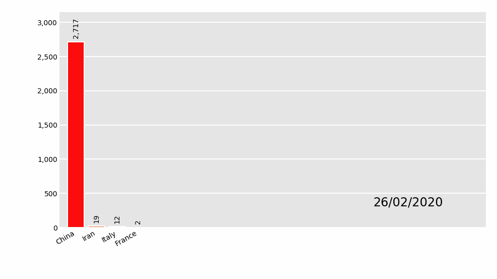

# Pandas-Alive

Animated plotting extension for Pandas with Matplotlib

**Pandas-Alive** is intended to provide a plotting backend for animated [matplotlib](https://matplotlib.org/) charts for [Pandas](https://pandas.pydata.org/) DataFrames, similar to the already [existing Visualization feature of Pandas](https://pandas.pydata.org/pandas-docs/stable/visualization.html).

With **Pandas-Alive**, creating stunning, animated visualisations is as easy as calling:

``` python
df.plot_animated()
```


## Installation

Install with `pip install pandas-alive`

## Usage

As this package builds upon [`bar_chart_race`](https://github.com/dexplo/bar_chart_race), the example data set is sourced from there.

Must begin with a pandas DataFrame containing 'wide' data where:

- Every row represents a single period of time
- Each column holds the value for a particular category
- The index contains the time component (optional)

The data below is an example of properly formatted data. It shows total deaths from COVID-19 for the highest 20 countries by date.


[Example Table](examples/example_dataset_table.md)

To produce the above visualisation:

- Set `output_file` for the visualisations to write to, or use `output_html` to return a HTML5 video
- Call `plot_animated()` on the DataFrame
- Done!

``` python
import pandas_alive

df = pandas_alive.load_dataset()

pandas_alive.output_file('example-barh-chart.gif')

df.plot_animated()

```

### Currently Supported Chart Types

`pandas-alive` current supports:

- [Horizontal Bar Charts](#horizontal-bar-charts)
- [Vertical Bar Charts](#vertical-bar-charts)
- [Line Charts](#line-charts)

#### Horizontal Bar Charts

``` python
import pandas_alive

df = pandas_alive.load_dataset()

pandas_alive.output_file('example-barh-chart.gif')

df.plot_animated()
```


#### Vertical Bar Charts

``` python
import pandas_alive

df = pandas_alive.load_dataset()

pandas_alive.output_file('example-barv-chart.gif')

df.plot_animated(orientation='v')
```



#### Line Charts

With as many lines as data columns in DataFrame.

``` python
import pandas_alive

df = pandas_alive.load_dataset()

pandas_alive.output_file('example-line-chart.gif')

df.diff().plot_animated(kind='line')
```


### Multiple Charts

`pandas-alive` supports multiple animated charts in a single visualisation.

- Create each chart type ensure to disable writing to file with `write_to_file=False`
- Create a list of all charts to include in animation
- Use `animate_multiple_plots` with a `filename` and the list of charts (this will use `matplotlib.subplots`)
- Done!

``` python
import pandas_alive

df = pandas_alive.load_dataset()

animated_line_chart = df.diff().plot_animated(kind='line',write_to_file=False,period_length=200)

animated_bar_chart = df.plot_animated(kind='barh',write_to_file=False,period_length=200)

pandas_alive.animate_multiple_plots('example-bar-and-line-chart.gif',[animated_bar_chart,animated_line_chart]
```


## Inspiration

The inspiration for this project comes from:

- [bar_chart_race](https://github.com/dexplo/bar_chart_race) by [Ted Petrou](https://github.com/tdpetrou)
- [Pandas-Bokeh](https://github.com/PatrikHlobil/Pandas-Bokeh) by [Patrik Hlobil](https://github.com/PatrikHlobil)

## Contributing

Pull requests are welcome! Please help cover more and more chart types!

## Requirements

This package utilises the [matplotlib.animation function](https://matplotlib.org/3.2.1/api/animation_api.html), thus requiring a writer library.

Ensure to have one of the supported tooling software installed prior to use!

- [ffmpeg](https://ffmpeg.org/)
- [ImageMagick](https://imagemagick.org/index.php)
- [Pillow](https://pillow.readthedocs.io/en/stable/)
- See more at <https://matplotlib.org/3.2.1/api/animation_api.html#writer-classes>
