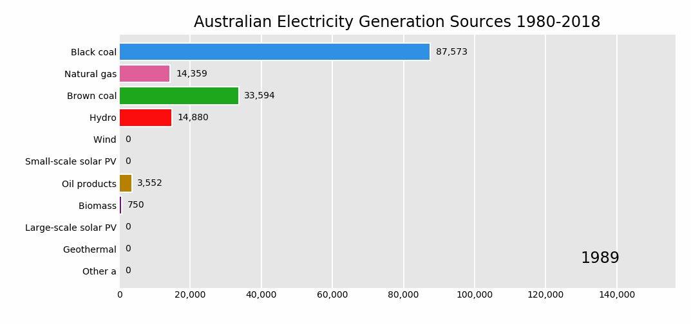
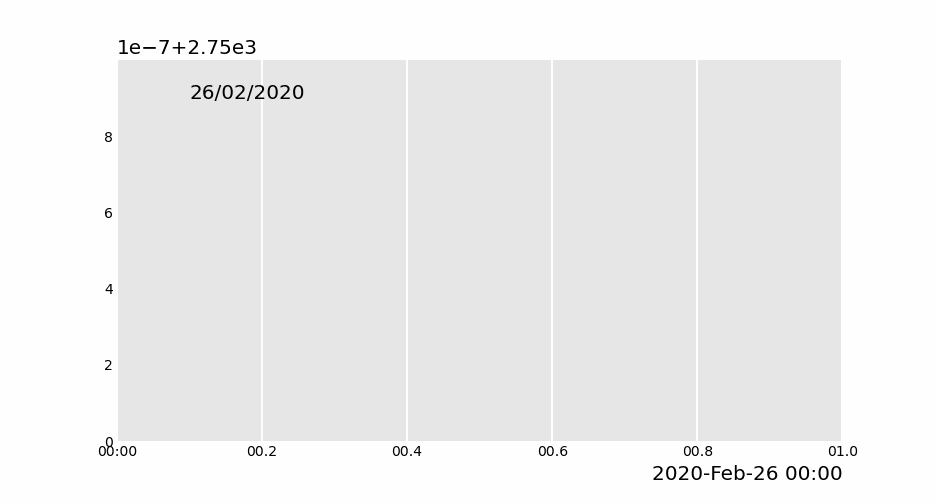
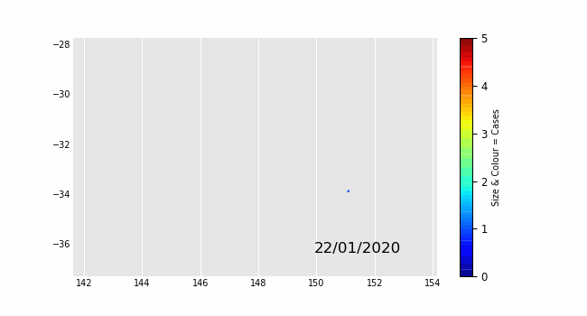
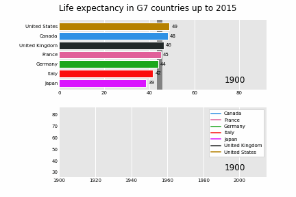
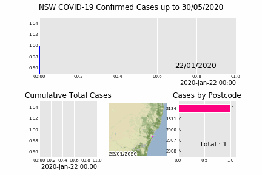

# Pandas_Alive

Animated plotting extension for Pandas with Matplotlib

[](https://jackmckew.github.io/pandas_alive/)  [](https://pepy.tech/project/pandas-alive/month) [](https://pypi.python.org/pypi/pandas_alive/) [](https://pypi.python.org/pypi/pandas_alive/) [](https://www.buymeacoffee.com/jackmckew)

**Pandas_Alive** is intended to provide a plotting backend for animated [matplotlib](https://matplotlib.org/) charts for [Pandas](https://pandas.pydata.org/) DataFrames, similar to the already [existing Visualization feature of Pandas](https://pandas.pydata.org/pandas-docs/stable/visualization.html).

With **Pandas_Alive**, creating stunning, animated visualisations is as easy as calling:

`df.plot_animated()`


## Table of Contents
<!-- START doctoc -->
<!-- END doctoc -->

## Installation

Install with `pip install pandas_alive`

## Usage

As this package was inspired by [`bar_chart_race`](https://github.com/dexplo/bar_chart_race), the example data set is sourced from there.

Must begin with a pandas DataFrame containing 'wide' data where:

- Every row represents a single period of time
- Each column holds the value for a particular category
- The index contains the time component (optional)

The data below is an example of properly formatted data. It shows total deaths from COVID-19 for the highest 20 countries by date.


To produce the above visualisation:

- Check [Requirements](#requirements) first to ensure you have the tooling installed!
- Call `plot_animated()` on the DataFrame
    - Either specify a file name to write to with `df.plot_animated(filename='example.mp4')` or use `df.plot_animated().get_html5_video` to return a HTML5 video
- Done!

``` python
import pandas_alive

covid_df = pandas_alive.load_dataset()

covid_df.plot_animated(filename='examples/example-barh-chart.gif')
```

### Currently Supported Chart Types

#### Horizontal Bar Chart Races

``` python
import pandas as pd
import pandas_alive

elec_df = pd.read_csv("data/Aus_Elec_Gen_1980_2018.csv",index_col=0,parse_dates=[0],thousands=',')

elec_df.fillna(0).plot_animated('examples/example-electricity-generated-australia.gif',period_fmt="%Y",title='Australian Electricity Generation Sources 1980-2018')
```


``` python
import pandas_alive

covid_df = pandas_alive.load_dataset()

def current_total(values):
    total = values.sum()
    s = f'Total : {int(total)}'
    return {'x': .85, 'y': .2, 's': s, 'ha': 'right', 'size': 11}

covid_df.plot_animated(filename='examples/summary-func-example.gif',period_summary_func=current_total)
```


``` python
import pandas as pd
import pandas_alive

elec_df = pd.read_csv("data/Aus_Elec_Gen_1980_2018.csv",index_col=0,parse_dates=[0],thousands=',')

elec_df.fillna(0).plot_animated('examples/fixed-example.gif',period_fmt="%Y",title='Australian Electricity Generation Sources 1980-2018',fixed_max=True,fixed_order=True)
```



``` python
import pandas_alive

covid_df = pandas_alive.load_dataset()

covid_df.plot_animated(filename='examples/perpendicular-example.gif',perpendicular_bar_func='mean')
```


#### Vertical Bar Chart Races

``` python
import pandas_alive

covid_df = pandas_alive.load_dataset()

covid_df.plot_animated(filename='examples/example-barv-chart.gif',orientation='v')
```


#### Line Charts

With as many lines as data columns in the DataFrame.

``` python
import pandas_alive

covid_df = pandas_alive.load_dataset()

covid_df.diff().fillna(0).plot_animated(filename='examples/example-line-chart.gif',kind='line',period_label={'x':0.1,'y':0.9})
```


#### Bar Charts

Similar to line charts with time as the x-axis

``` python
import pandas_alive

covid_df = pandas_alive.load_dataset()

covid_df.sum(axis=1).fillna(0).plot_animated(filename='examples/example-bar-chart.gif',kind='bar',period_label={'x':0.1,'y':0.9})
```



#### Scatter Charts

``` python
import pandas as pd
import pandas_alive

max_temp_df = pd.read_csv(
    "data/Newcastle_Australia_Max_Temps.csv",
    parse_dates={"Timestamp": ["Year", "Month", "Day"]},
)
min_temp_df = pd.read_csv(
    "data/Newcastle_Australia_Min_Temps.csv",
    parse_dates={"Timestamp": ["Year", "Month", "Day"]},
)

merged_temp_df = pd.merge_asof(max_temp_df, min_temp_df, on="Timestamp")

merged_temp_df.index = pd.to_datetime(merged_temp_df["Timestamp"].dt.strftime('%Y/%m/%d'))

keep_columns = ["Minimum temperature (Degree C)", "Maximum temperature (Degree C)"]

merged_temp_df[keep_columns].resample("Y").mean().plot_animated(filename='examples/example-scatter-chart.gif',kind="scatter",title='Max & Min Temperature Newcastle, Australia')

```


#### Pie Charts

``` python
import pandas_alive

covid_df = pandas_alive.load_dataset()

covid_df.plot_animated(filename='examples/example-pie-chart.gif',kind="pie",rotatelabels=True,period_label={'x':0,'y':0})
```


#### Bubble Charts

Bubble charts are generated from a multi-indexed dataframes. Where the index is the time period (optional) and the axes are defined with `x_data_label` & `y_data_label` which should be passed a string in the level 0 column labels.

See an example multi-indexed dataframe at: <https://github.com/JackMcKew/pandas_alive/tree/master/data/multi.csv>

``` python
import pandas_alive

multi_index_df = pd.read_csv("data/multi.csv", header=[0, 1], index_col=0)

multi_index_df.index = pd.to_datetime(multi_index_df.index,dayfirst=True)

map_chart = multi_index_df.plot_animated(
    kind="bubble",
    filename="examples/example-bubble-chart.gif",
    x_data_label="Longitude",
    y_data_label="Latitude",
    size_data_label="Cases",
)
```



#### GeoSpatial Charts

GeoSpatial charts can now be animated easily using [`geopandas`](https://geopandas.org/index.html)!

> If using Windows, [anaconda](https://www.anaconda.com/) is the easiest way to install with all GDAL dependancies.

Must begin with a `geopandas` GeoDataFrame containing 'wide' data where:

- Every row represents a single geometry (Point or Polygon).
    - The index contains the geometry label (optional)
- Each column represents a single period in time.

> These can be easily composed by transposing data compatible with the rest of the charts using `df = df.T`.

##### GeoSpatial Point Charts

``` python
import geopandas
import pandas_alive
import contextily

gdf = geopandas.read_file('data/nsw-covid19-cases-by-postcode.gpkg')
gdf.index = gdf.postcode
gdf = gdf.drop('postcode',axis=1)

map_chart = gdf.plot_animated(filename='examples/example-geo-point-chart.gif',basemap_format={'source':contextily.providers.Stamen.Terrain})
```


##### Polygon GeoSpatial Charts

Supports GeoDataFrames containing Polygons!

``` python
import geopandas
import pandas_alive
import contextily

gdf = geopandas.read_file('data/italy-covid-region.gpkg')
gdf.index = gdf.region
gdf = gdf.drop('region',axis=1)

map_chart = gdf.plot_animated(filename='examples/example-geo-polygon-chart.gif',basemap_format={'source':contextily.providers.Stamen.Terrain})
```


### Multiple Charts

`pandas_alive` supports multiple animated charts in a single visualisation.

- Create a list of all charts to include in animation
- Use `animate_multiple_plots` with a `filename` and the list of charts (this will use `matplotlib.subplots`)
- Done!

``` python
import pandas_alive

covid_df = pandas_alive.load_dataset()

animated_line_chart = covid_df.diff().fillna(0).plot_animated(kind='line',period_label=False)

animated_bar_chart = covid_df.plot_animated(n_visible=10)

pandas_alive.animate_multiple_plots('examples/example-bar-and-line-chart.gif',[animated_bar_chart,animated_line_chart])
```


#### Urban Population

``` python
import pandas_alive

urban_df = pandas_alive.load_dataset("urban_pop")

animated_line_chart = (
    urban_df.sum(axis=1)
    .pct_change()
    .fillna(method='bfill')
    .mul(100)
    .plot_animated(kind="line", title="Total % Change in Population",period_label=False)
)

animated_bar_chart = urban_df.plot_animated(n_visible=10,title='Top 10 Populous Countries',period_fmt="%Y")

pandas_alive.animate_multiple_plots('examples/example-bar-and-line-urban-chart.gif',[animated_bar_chart,animated_line_chart],title='Urban Population 1977 - 2018',adjust_subplot_top=0.85)
```


#### Life Expectancy in G7 Countries

``` python
import pandas_alive
import pandas as pd

data_raw = pd.read_csv(
    "https://raw.githubusercontent.com/owid/owid-datasets/master/datasets/Long%20run%20life%20expectancy%20-%20Gapminder%2C%20UN/Long%20run%20life%20expectancy%20-%20Gapminder%2C%20UN.csv"
)

list_G7 = [
    "Canada",
    "France",
    "Germany",
    "Italy",
    "Japan",
    "United Kingdom",
    "United States",
]

data_raw = data_raw.pivot(
    index="Year", columns="Entity", values="Life expectancy (Gapminder, UN)"
)

data = pd.DataFrame()
data["Year"] = data_raw.reset_index()["Year"]
for country in list_G7:
    data[country] = data_raw[country].values

data = data.fillna(method="pad")
data = data.fillna(0)
data = data.set_index("Year").loc[1900:].reset_index()

data["Year"] = pd.to_datetime(data.reset_index()["Year"].astype(str))

data = data.set_index("Year")

animated_bar_chart = data.plot_animated(
    period_fmt="%Y",perpendicular_bar_func="mean", period_length=200,fixed_max=True
)

animated_line_chart = data.plot_animated(
    kind="line", period_fmt="%Y", period_length=200,fixed_max=True
)

pandas_alive.animate_multiple_plots(
    "examples/life-expectancy.gif",
    plots=[animated_bar_chart, animated_line_chart],
    title="Life expectancy in G7 countries up to 2015",
    adjust_subplot_left=0.2,
)

```



#### NSW COVID Visualisation

``` python
import geopandas
import pandas as pd
import pandas_alive
import contextily
import matplotlib.pyplot as plt

import urllib.request, json

with urllib.request.urlopen(
    "https://data.nsw.gov.au/data/api/3/action/package_show?id=aefcde60-3b0c-4bc0-9af1-6fe652944ec2"
) as url:
    data = json.loads(url.read().decode())

# Extract url to csv component
covid_nsw_data_url = data["result"]["resources"][0]["url"]

# Read csv from data API url
nsw_covid = pd.read_csv(covid_nsw_data_url)
postcode_dataset = pd.read_csv("data/postcode-data.csv")

# Prepare data from NSW health dataset


nsw_covid = nsw_covid.fillna(9999)
nsw_covid["postcode"] = nsw_covid["postcode"].astype(int)

grouped_df = nsw_covid.groupby(["notification_date", "postcode"]).size()
grouped_df = pd.DataFrame(grouped_df).unstack()
grouped_df.columns = grouped_df.columns.droplevel().astype(str)

grouped_df = grouped_df.fillna(0)
grouped_df.index = pd.to_datetime(grouped_df.index)

cases_df = grouped_df

# Clean data in postcode dataset prior to matching

grouped_df = grouped_df.T
postcode_dataset = postcode_dataset[postcode_dataset['Longitude'].notna()]
postcode_dataset = postcode_dataset[postcode_dataset['Longitude'] != 0]
postcode_dataset = postcode_dataset[postcode_dataset['Latitude'].notna()]
postcode_dataset = postcode_dataset[postcode_dataset['Latitude'] != 0]
postcode_dataset['Postcode'] = postcode_dataset['Postcode'].astype(str)

# Build GeoDataFrame from Lat Long dataset and make map chart
grouped_df['Longitude'] = grouped_df.index.map(postcode_dataset.set_index('Postcode')['Longitude'].to_dict())
grouped_df['Latitude'] = grouped_df.index.map(postcode_dataset.set_index('Postcode')['Latitude'].to_dict())
gdf = geopandas.GeoDataFrame(
    grouped_df, geometry=geopandas.points_from_xy(grouped_df.Longitude, grouped_df.Latitude),crs="EPSG:4326")
gdf = gdf.dropna()

# Prepare GeoDataFrame for writing to geopackage
gdf = gdf.drop(['Longitude','Latitude'],axis=1)
gdf.columns = gdf.columns.astype(str)
gdf['postcode'] = gdf.index
gdf.to_file("data/nsw-covid19-cases-by-postcode.gpkg", layer='nsw-postcode-covid', driver="GPKG")

# Prepare GeoDataFrame for plotting
gdf.index = gdf.postcode
gdf = gdf.drop('postcode',axis=1)
gdf = gdf.to_crs("EPSG:3857") #Web Mercator

map_chart = gdf.plot_animated(basemap_format={'source':contextily.providers.Stamen.Terrain},cmap='cool')

cases_df.to_csv('data/nsw-covid-cases-by-postcode.csv')

from datetime import datetime

bar_chart = cases_df.sum(axis=1).plot_animated(
    kind='line',
    label_events={
        'Ruby Princess Disembark':datetime.strptime("19/03/2020", "%d/%m/%Y"),
        'Lockdown':datetime.strptime("31/03/2020", "%d/%m/%Y")
    },
    fill_under_line_color="blue",
    enable_progress_bar=True
)

map_chart.ax.set_title('Cases by Location')

grouped_df = pd.read_csv('data/nsw-covid-cases-by-postcode.csv', index_col=0, parse_dates=[0])

line_chart = (
    grouped_df.sum(axis=1)
    .cumsum()
    .fillna(0)
    .plot_animated(kind="line", period_label=False, title="Cumulative Total Cases")
)


def current_total(values):
    total = values.sum()
    s = f'Total : {int(total)}'
    return {'x': .85, 'y': .2, 's': s, 'ha': 'right', 'size': 11}

race_chart = grouped_df.cumsum().plot_animated(
    n_visible=5, title="Cases by Postcode", period_label=False,period_summary_func=current_total
)

import time

timestr = time.strftime("%d/%m/%Y")

plots = [bar_chart, line_chart, map_chart, race_chart]

from matplotlib import rcParams

rcParams.update({"figure.autolayout": False})

figs = plt.figure()
gs = figs.add_gridspec(2, 3, hspace=0.5)
f3_ax1 = figs.add_subplot(gs[0, :])
f3_ax1.set_title(bar_chart.title)
bar_chart.ax = f3_ax1

f3_ax2 = figs.add_subplot(gs[1, 0])
f3_ax2.set_title(line_chart.title)
line_chart.ax = f3_ax2

f3_ax3 = figs.add_subplot(gs[1, 1])
f3_ax3.set_title(map_chart.title)
map_chart.ax = f3_ax3

f3_ax4 = figs.add_subplot(gs[1, 2])
f3_ax4.set_title(race_chart.title)
race_chart.ax = f3_ax4

timestr = cases_df.index.max().strftime("%d/%m/%Y")
figs.suptitle(f"NSW COVID-19 Confirmed Cases up to {timestr}")

pandas_alive.animate_multiple_plots(
    'examples/nsw-covid.gif',
    plots,
    figs
)
```



#### Italy COVID Visualisation

``` python
import geopandas
import pandas as pd
import pandas_alive
import contextily
import matplotlib.pyplot as plt


region_gdf = geopandas.read_file('data\geo-data\italy-with-regions')
region_gdf.NOME_REG = region_gdf.NOME_REG.str.lower().str.title()
region_gdf = region_gdf.replace('Trentino-Alto Adige/Sudtirol','Trentino-Alto Adige')
region_gdf = region_gdf.replace("Valle D'Aosta/Vallée D'Aoste\r\nValle D'Aosta/Vallée D'Aoste","Valle d'Aosta")

italy_df = pd.read_csv('data\Regional Data - Sheet1.csv',index_col=0,header=1,parse_dates=[0])

italy_df = italy_df[italy_df['Region'] != 'NA']

cases_df = italy_df.iloc[:,:3]
cases_df['Date'] = cases_df.index
pivoted = cases_df.pivot(values='New positives',index='Date',columns='Region')
pivoted.columns = pivoted.columns.astype(str)
pivoted = pivoted.rename(columns={'nan':'Unknown Region'})

cases_gdf = pivoted.T
cases_gdf['geometry'] = cases_gdf.index.map(region_gdf.set_index('NOME_REG')['geometry'].to_dict())

cases_gdf = cases_gdf[cases_gdf['geometry'].notna()]

cases_gdf = geopandas.GeoDataFrame(cases_gdf, crs=region_gdf.crs, geometry=cases_gdf.geometry)

gdf = cases_gdf

map_chart = gdf.plot_animated(basemap_format={'source':contextily.providers.Stamen.Terrain},cmap='viridis')

cases_df = pivoted

from datetime import datetime

bar_chart = cases_df.sum(axis=1).plot_animated(
    kind='line',
    label_events={
        'Schools Close':datetime.strptime("4/03/2020", "%d/%m/%Y"),
        'Phase I Lockdown':datetime.strptime("11/03/2020", "%d/%m/%Y"),
        '1M Global Cases':datetime.strptime("02/04/2020", "%d/%m/%Y"),
        '100k Global Deaths':datetime.strptime("10/04/2020", "%d/%m/%Y"),
        'Manufacturing Reopens':datetime.strptime("26/04/2020", "%d/%m/%Y"),
        'Phase II Lockdown':datetime.strptime("4/05/2020", "%d/%m/%Y"),

    },
    fill_under_line_color="blue",
    enable_progress_bar=True
)

map_chart.ax.set_title('Cases by Location')

line_chart = (
    cases_df.sum(axis=1)
    .cumsum()
    .fillna(0)
    .plot_animated(kind="line", period_label=False, title="Cumulative Total Cases")
)


def current_total(values):
    total = values.sum()
    s = f'Total : {int(total)}'
    return {'x': .85, 'y': .2, 's': s, 'ha': 'right', 'size': 11}

race_chart = cases_df.cumsum().plot_animated(
    n_visible=5, title="Cases by Region", period_label=False,period_summary_func=current_total
)

import time

timestr = time.strftime("%d/%m/%Y")

plots = [bar_chart, race_chart, map_chart, line_chart]

# Otherwise titles overlap and adjust_subplot does nothing
from matplotlib import rcParams
from matplotlib.animation import FuncAnimation

rcParams.update({"figure.autolayout": False})

figs = plt.figure()
gs = figs.add_gridspec(2, 3, hspace=0.5)
f3_ax1 = figs.add_subplot(gs[0, :])
f3_ax1.set_title(bar_chart.title)
bar_chart.ax = f3_ax1

f3_ax2 = figs.add_subplot(gs[1, 0])
f3_ax2.set_title(race_chart.title)
race_chart.ax = f3_ax2

f3_ax3 = figs.add_subplot(gs[1, 1])
f3_ax3.set_title(map_chart.title)
map_chart.ax = f3_ax3

f3_ax4 = figs.add_subplot(gs[1, 2])
f3_ax4.set_title(line_chart.title)
line_chart.ax = f3_ax4

axes = [f3_ax1, f3_ax2, f3_ax3, f3_ax4]
timestr = cases_df.index.max().strftime("%d/%m/%Y")
figs.suptitle(f"Italy COVID-19 Confirmed Cases up to {timestr}")

pandas_alive.animate_multiple_plots(
    'examples/italy-covid.gif',
    plots,
    figs
)
```


### HTML 5 Videos

`Pandas_Alive` supports rendering HTML5 videos through the use of `df.plot_animated().get_html5_video()`. `.get_html5_video` saves the animation as an h264 video, encoded in base64 directly into the HTML5 video tag. This respects the rc parameters for the writer as well as the bitrate. This also makes use of the interval to control the speed, and uses the repeat parameter to decide whether to loop.

This is typically used in Jupyter notebooks.

``` python
import pandas_alive
from IPython.display import HTML

covid_df = pandas_alive.load_dataset()

animated_html = covid_df.plot_animated().get_html5_video()

HTML(animated_html)
```

### Progress Bars!

Generating animations can take some time, so enable progress bars by installing [tqdm](https://github.com/tqdm/tqdm) with `pip install tqdm` and using the keyword `enable_progress_bar=True`.

By default Pandas_Alive will create a `tqdm` progress bar for the number of frames to animate, and update the progres bar after each frame.

``` python
import pandas_alive

covid_df = pandas_alive.load_dataset()

covid_df.plot_animated(enable_progress_bar=True)
```

Example of TQDM in action:


## Future Features

A list of future features that may/may not be developed is:

- ~~Geographic charts (currently using OSM export image, potential [geopandas](https://geopandas.org/))~~
- ~~Loading bar support (potential [tqdm](https://github.com/tqdm/tqdm) or [alive-progress](https://github.com/rsalmei/alive-progress))~~
- ~~Potentially support writing to GIF in memory with <https://github.com/maxhumber/gif>~~
- ~~Support custom figures & axes for multiple plots (eg, gridspec)~~

## Inspiration

The inspiration for this project comes from:

- [bar_chart_race](https://github.com/dexplo/bar_chart_race) by [Ted Petrou](https://github.com/tdpetrou)
- [Pandas-Bokeh](https://github.com/PatrikHlobil/Pandas-Bokeh) by [Patrik Hlobil](https://github.com/PatrikHlobil)

## Requirements

If you get an error such as `TypeError: 'MovieWriterRegistry' object is not an iterator`, this signals there isn't a writer library installed on your machine.

This package utilises the [matplotlib.animation function](https://matplotlib.org/3.2.1/api/animation_api.html), thus requiring a writer library.

Ensure to have one of the supported tooling software installed prior to use!

- [ffmpeg](https://ffmpeg.org/)
- [ImageMagick](https://imagemagick.org/index.php)
- See more at <https://matplotlib.org/3.2.1/api/animation_api.html#writer-classes>

> If the output file name has an extension of `.gif`, `pandas_alive` will write this with `PIL` in memory

## Documentation

Documentation is provided at <https://jackmckew.github.io/pandas_alive/>

## Contributing

Pull requests are welcome! Please help to cover more and more chart types!

### Development

To get started in development, clone a copy of this repository to your PC. This will now enable you to create a Jupyter notebook or a standalone `.py` file, and import `pandas_alive` as a local module. Now you can create new chart types in `pandas_alive/charts.py` or `pandas_alive/geocharts.py` to build to your hearts content!

## [Changelog](CHANGELOG.md)
